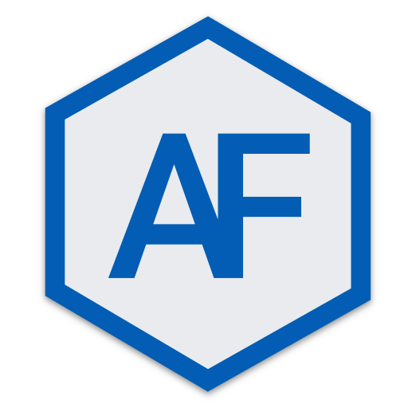

<div align="center">
  
</div>
<h1 align="center">
  arthurfindelair.com
</h1>


## 🛠 Installation & Set Up

1. Install the Gatsby CLI

   ```sh
   npm install -g gatsby-cli
   ```

2. Install and use the correct version of Node using [NVM](https://github.com/nvm-sh/nvm)

   ```sh
   nvm install
   ```

3. Install dependencies

   ```sh
   yarn
   ```

4. Start the development server

   ```sh
   npm start
   ```

## 🚀 Building and Running for Production

Simply push source code to the `source` branch. A github action takes care of building and publishing.

## 🙏 Credits

This is a modified version of [Brittany Chiang's website](https://brittanychiang.com).
All credit goes to her.
